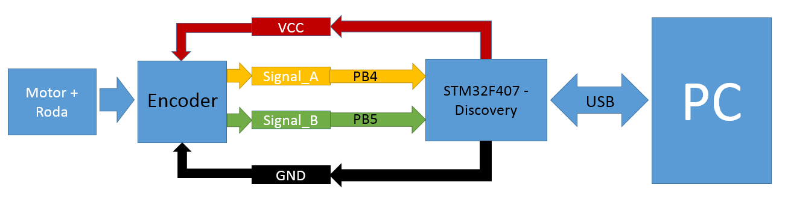
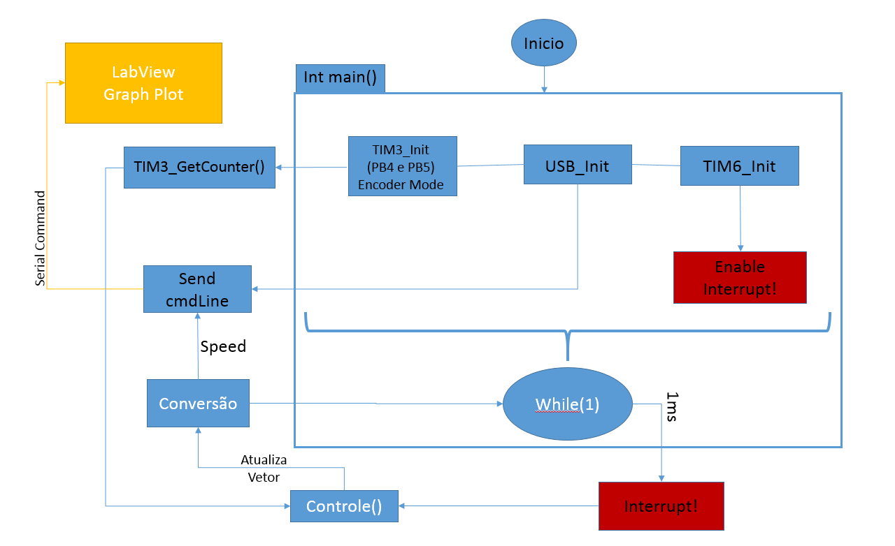

# Plot de velocidade de Motor DC em tempo real
## Proposta
Este projeto tem como objetivo receber e enviar comandos pela porta USB de uma STM32F407VG-Discovery para controlar, tanto em malha aberta quanto em malha fechada, através de controle PID, os 4 motores do robô utilizado pela SSL da RoboIME. 

O código foi baseado na biblioteca SPL (Standard Peripherals Library) e executa: 4 leituras de Encoder, 8 PWM's, 8 GPIO's como porta de saída e 1 TIMER (TIM6) para interrupção de controle, além das portas necessárias para a comunicação USB.

Serão feitas medições periódicas no valor
do contador do TIMER a fim de, através das devidas conversões matemáticas, obter a velocidade do motor em tempo real.

Através da comunicação USB entre a Discovery e um PC os resultados de medição de velocidade são enviados continuamente para a porta serial, onde podem ser plotados através do LabView.

## Periféricos
Para a execução do projeto, utiliza-se o robô da SSL, que conta com:
#### 1 STM32F407VG Discovery
#### 4 Motores DC 7.2V
#### 4 Encoders em quadratura de 400 divisões
#### 1 PC - LabView -
#### 4 Rodas de Metal

Figura 1: Diagrama de Blocos

## Pinagens:
### MOTOR0:
#### MAH: PC9 -> PWM: TIM8_CH4
#### MAL: PE5 -> GPIO_OUT
#### MBH PC7 -> PWM: TIM8_CH2
#### MBL: PC13 -> GPIO_OUT
#### ENCA: PB4 -> TIM3_CH1: Encoder Mode
#### ENCB: PB5 -> TIM3_CH2: Encoder Mode

### MOTOR1:
#### MAH: PA8 -> PWM: TIM1_CH1
#### MAL: PE6 -> GPIO_OUT
#### MBH PC8 -> PWM: TIM8_CH3
#### MBL: PE4 -> GPIO_OUT
#### ENCA: PA15 -> TIM2_CH1: Encoder Mode
#### ENCB: PB3 -> TIM2_CH2: Encoder Mode

### MOTOR2:
#### MAH: PC6 -> PWM: TIM8_CH1
#### MAL: PC2 -> GPIO_OUT
#### MBH PCE11 -> PWM: TIM1_CH2
#### MBL: PB1 -> GPIO_OUT
#### ENCA: PA0 -> TIM5_CH1: Encoder Mode
#### ENCB: PA1 -> TIM5_CH2: Encoder Mode

### MOTOR3:
#### PE14 -> PWM: TIM1_CH4
#### MAL: PB12 -> GPIO_OUT
#### MBH PE13 -> PWM: TIM1_CH3
#### MBL: PB11 -> GPIO_OUT
#### ENCA: PB6 -> TIM4_CH1: Encoder Mode
#### ENCB: PB7 -> TIM4_CH2: Encoder Mode

#### 1ms Interrupter -> TIM6: Interrupt Enable
#### USB Serial -> PA11 e PB12: Special Mode

## Fluxograma
O código segue em um Loop Infinito até que seja chamada a interrupção do Timer 6, que acontece a cada 1ms, chamando as funções de controle que atualizam os valores das velocidades armazenadas no objeto "robo" e enviam novas velocidades desejadas para a malha de controle. 

O valor atual da velocidade é enviado por comunicação serial via USB de forma que, através de um programa no LabView, pode-se ler continuamente as velocidades medidas e plotá-las em um gráfico. As velocidades são enviadas na porta serial através de uma mensagem separadas por espaço: "v0 v1 v2 v3" (motores 0, 1, 2 e 3, respectivamente).

Figura 2: Fluxograma

## Interfaces para usuário
O código possui 5 tipos de comandos, que são reconhecidos pela quantidade de argumentos lidos na porta serial. Todos os comandos devem ser iniciados com o argumento "\[A", equivalente a pressionar a tecla de seta para cima no prompt de comando, e pode-se realizar os seguintes comandos:
"\[A": imprime na porta serial as atuais constantes de PID separadas por espaço e, na linha seguinte, as 4 velocidades atuais das rodas
"kp ki kd
v0 v1 v2 v3"

"\[A] int1": imprime na porta serial as 4 velocidades atuais das rodas
"v0 v1 v2 v3"

"\[A] int1 int2": envia para o motor "int1", que deve ser um número de 0 a 3, a velocidade "int2", que deve ser enviada em m/s vezes 1000 (solução adotada para não necessitar do uso de float), e imprime na porta serial as 4 velocidades atuais das rodas

"\[A] int1 int2 int3": envia para o objeto "robo" novas constante de controle PID, de forma que kp=int1, ki=int2 e kd=int3 (as 3 constantes estão na ordem de 1000), e imprime na porta serial as 4 velocidades atuais das rodas

"\[A] int1 int2 int3 int4": envia 4 novos valores de velocidades desejadas para as 4 rodas e imprime na porta serial as 4 velocidades atuais das rodas

-- É importante que todos os comandos enviem os valores atuais das velocidades para não prejudicar o plot do gráfico.

## Referências
[Firmware SSL 2016](https://github.com/roboime/roboime-firmware)

[User Manual STM32F407VG](http://www.st.com/content/ccc/resource/technical/document/user_manual/70/fe/4a/3f/e7/e1/4f/7d/DM00039084.pdf/files/DM00039084.pdf/jcr:content/translations/en.DM00039084.pdf)

Aulas de Microcontroladores
# RoboIME-PID
